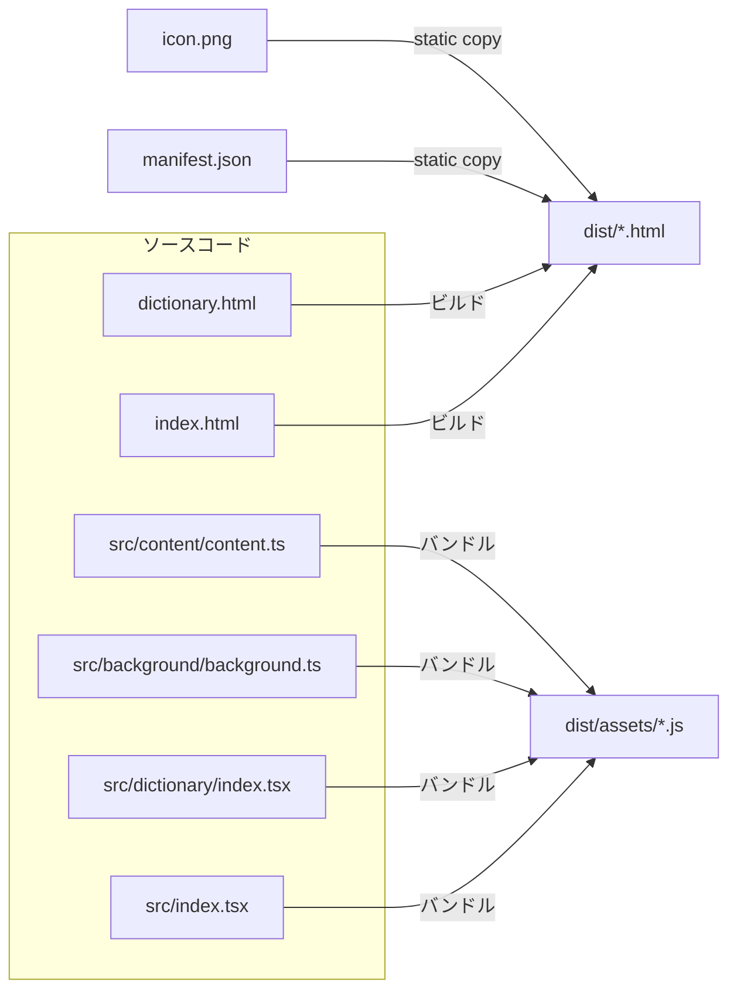

# 全体設計

## ディレクトリ構成

```
v1.3/
├── index.html
├── dictionary.html
├── manifest.json
├── icon.png
├── vite.config.ts
├── package.json
├── tsconfig.json
├── src/
│   ├── index.tsx
│   ├── background/
│   │   └── background.ts
│   ├── content/
│   │   └── content.ts
│   ├── popup/
│   │   ├── Popup.tsx
│   │   └── style.css
│   ├── dictionary/
│   │   ├── index.tsx
│   │   └── dictionaryPage.tsx
│   └── assets/
│       └── ... (その他静的アセット)
└── dist/  (ビルド出力)
```

## ビルド設定 (`vite.config.ts`)

- `base`: `'./'`  
- `build.outDir`: `'dist'`  
- `build.emptyOutDir`: `true`  
- `build.rollupOptions.input`:  
  ```ts
  {
    main: fileURLToPath(new URL('index.html', import.meta.url)),
    dictionary: fileURLToPath(new URL('dictionary.html', import.meta.url)),
    background: fileURLToPath(new URL('src/background/background.ts', import.meta.url)),
    content: fileURLToPath(new URL('src/content/content.ts', import.meta.url)),
  }
  ```  
- プラグイン:  
  - `@vitejs/plugin-react`  
  - `vite-plugin-static-copy`（`manifest.json` と `icon.png` を `dist` へコピー）

## Manifest設定

- `manifest_version`: `3`  
- `action.default_popup`: `"index.html"`  
- `background.service_worker`: `"assets/background.js"`  
- `content_scripts`:  
  ```json
  [
    {
      "matches": ["<all_urls>"],
      "js": ["assets/content.js"]
    }
  ]
  ```  
- `web_accessible_resources`:  
  ```json
  [
    {
      "resources": ["assets/*", "index.html", "dictionary.html"],
      "matches": ["<all_urls>"]
    }
  ]
  ```

## ビルド後構成 (`dist/`)

```
dist/
├── index.html
├── dictionary.html
├── manifest.json
├── icon.png
└── assets/
    ├── main.js
    ├── dictionary.js
    ├── background.js
    └── content.js
```

## ビルド & デプロイ手順

1. `npm install`  
2. `npm run build`  
3. Chrome/Firefox 等の拡張機能ページで `dist/` を読み込む

## アーキテクチャ図



上記設計で問題なければ、実装フェーズに進みます。